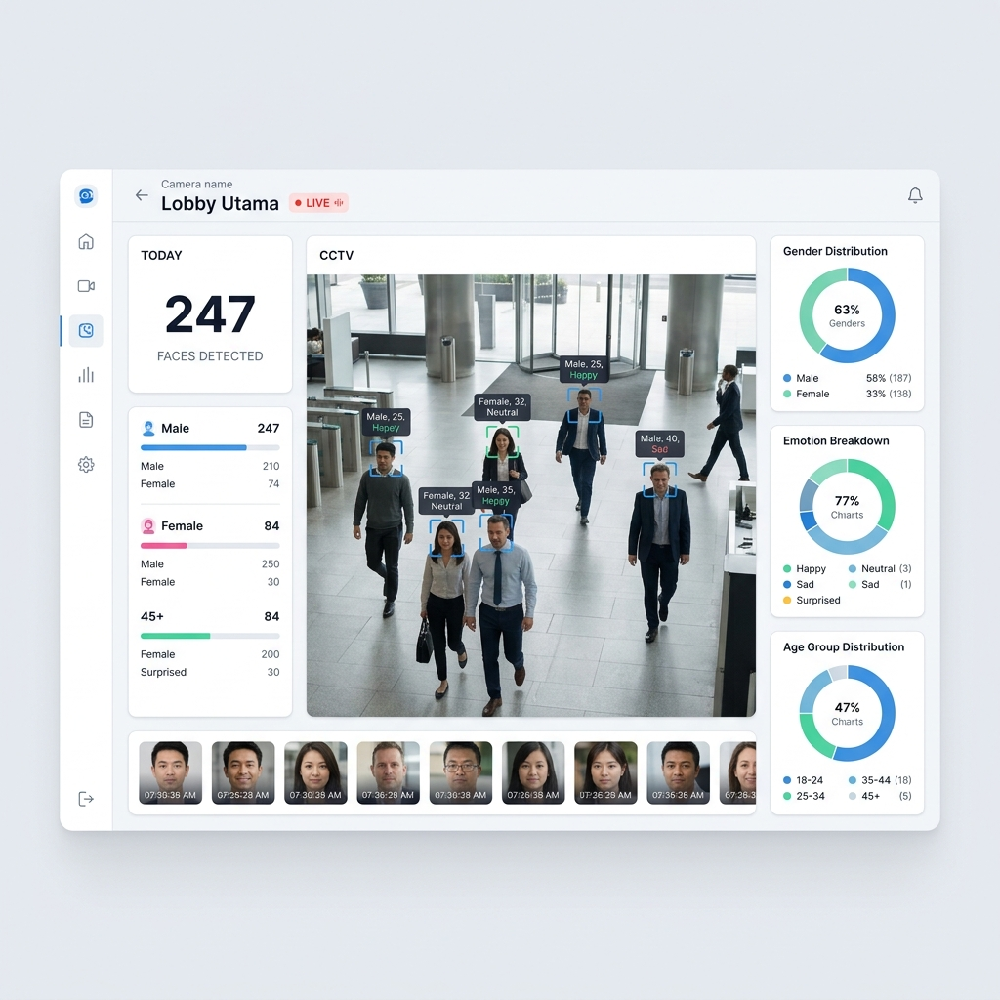

# 🛡️ Face Surveillance Dashboard

> Real-time face detection, emotion/age/gender analysis from CCTV camera streams (RTSP/HLS).



## ✨ Features

- **Real-time CCTV Monitoring** — Stream RTSP/HLS cameras with live face detection overlay
- **AI-Powered Analysis** — Gender, emotion (7 categories), and age classification using DeepFace
- **Modern Detection Pipeline** — YOLOv8n-face + ByteTrack + InsightFace (with DeepFace fallback)
- **Detection Zones** — Draw polygonal regions on camera feeds to focus detection
- **Live Dashboard** — 3-column layout with stats, video feed, and analytics charts
- **WebSocket Streaming** — Real-time frame & detection broadcast to connected clients
- **Snapshot Gallery** — Browse, filter, and download face crop snapshots
- **Analytics Page** — Traffic trends, gender/emotion/age charts, heatmap, and data table export (CSV/PDF)
- **Alert System** — Configurable alert rules with real-time notifications
- **Camera Management** — Full CRUD for cameras with start/stop stream control
- **MediaMTX Integration** — Optional RTSP proxy for stable, re-streamable camera feeds
- **GPU Acceleration** — Optional NVIDIA CUDA support for faster AI inference
- **Supabase Backend** — PostgreSQL persistence with Supabase client
- **Docker Ready** — One-command deployment with docker-compose

---

## 🏗️ Tech Stack

| Layer      | Technology                                          |
|------------|-----------------------------------------------------|
| Frontend   | React 18, Vite, TypeScript, Tailwind CSS            |
| State      | Zustand                                             |
| Charts     | Recharts                                            |
| Backend    | FastAPI, Python 3.11                                |
| AI/ML      | YOLOv8, ByteTrack, InsightFace, DeepFace, OpenCV    |
| RTSP Proxy | MediaMTX (optional)                                 |
| Database   | Supabase (PostgreSQL)                               |
| Real-time  | WebSocket (native FastAPI)                          |
| Deploy     | Docker, docker-compose, NVIDIA Container Toolkit    |

---

## 📋 Prerequisites

- **Node.js** ≥ 18 (for frontend)
- **Python** ≥ 3.10 (for backend)
- **Supabase** account (free tier works)
- **Docker** & **docker-compose** (optional, for containerized deployment)
- **NVIDIA GPU** + drivers (optional, for GPU acceleration)

---

## 🚀 Quick Start

### 1. Clone & Setup Environment

```bash
git clone <repository-url>
cd face-surveillance

# Copy environment files
cp .env.example .env
cp frontend/.env.example frontend/.env
```

### 2. Configure Supabase

1. Create a new project at [supabase.com](https://supabase.com)
2. Go to **SQL Editor** and run the migration script:

```bash
# Copy the contents of this file into Supabase SQL Editor
cat backend/migrations/001_initial.sql
```

3. Update `.env` with your Supabase credentials:

```env
SUPABASE_URL=https://your-project.supabase.co
SUPABASE_API_KEY=your-supabase-anon-key
```

### 3. Backend Setup

```bash
cd backend

# Create virtual environment
python -m venv venv

# Activate (Windows)
venv\Scripts\activate
# Activate (Linux/Mac)
# source venv/bin/activate

# Install dependencies
pip install -r requirements.txt

# Start the server
uvicorn app.main:app --reload
```

The API will be available at `http://localhost:8000`.

> **API Docs:** Visit `http://localhost:8000/docs` for interactive Swagger documentation.

### 4. Frontend Setup

```bash
cd frontend

# Install dependencies
npm install

# Start dev server
npm run dev
```

The dashboard will be available at `http://localhost:5173`.

### 5. Generate Mock Data (Optional)

If you don't have a real RTSP camera, you can populate the database with mock data for demo purposes:

```bash
# Generate 100 random face detections
curl -X POST http://localhost:8000/api/debug/generate-mock?count=100
```

This endpoint is **only available in development mode** (`ENV=development`).

To clear all mock data:

```bash
curl -X DELETE http://localhost:8000/api/debug/clear-mock
```

---

## 🐳 Docker Deployment

### Standard (CPU)

```bash
# Build and start all services (backend, frontend, mediamtx)
docker compose up --build

# Or run in detached mode
docker compose up -d --build
```

### With GPU Acceleration

```bash
# Build backend with GPU support
docker compose build --build-arg USE_GPU=true backend

# Start all services
docker compose up -d
```

> **Note:** GPU support requires the [NVIDIA Container Toolkit](https://docs.nvidia.com/datacenter/cloud-native/container-toolkit/install-guide.html) installed on the host.

Services:
- **Backend:** `http://localhost:8000`
- **Frontend:** `http://localhost:5173`
- **MediaMTX RTSP:** `rtsp://localhost:8554`
- **MediaMTX API:** `http://localhost:9997`

---

## 📡 MediaMTX Setup

### Architecture

```
┌─────────────┐      ┌──────────────┐      ┌──────────────┐      ┌──────────────┐
│   Camera    │ RTSP │   MediaMTX   │ RTSP │   Backend    │  WS  │   Frontend   │
│  (RTSP/IP)  │─────▶│  (proxy)     │─────▶│  (FastAPI)   │─────▶│  (React)     │
└─────────────┘      └──────────────┘      └──────────────┘      └──────────────┘
                           │
                     Port 8554 (RTSP)
                     Port 1935 (RTMP)
                     Port 8888 (HLS)
                     Port 9997 (API)
```

### Why MediaMTX?

- **Stable re-streaming**: Multiple consumers can read the same stream without reconnecting to the camera
- **Protocol conversion**: Access RTSP streams via RTMP or HLS
- **Resilience**: MediaMTX handles reconnection to unstable cameras
- **Centralized management**: REST API for programmatic stream control

### Testing with a Video File

If you don't have an RTSP camera, you can push a local video file as a simulated stream:

```bash
# Push a video file to MediaMTX (loops forever)
ffmpeg -re -stream_loop -1 -i test_video.mp4 -c copy -f rtsp rtsp://localhost:8554/cam1

# Or with transcoding (if codec doesn't match)
ffmpeg -re -stream_loop -1 -i test_video.mp4 \
  -c:v libx264 -preset ultrafast -tune zerolatency \
  -f rtsp rtsp://localhost:8554/cam1
```

Then create a camera in the dashboard with RTSP URL: `rtsp://localhost:8554/cam1`

### Disabling MediaMTX

MediaMTX is **optional**. To bypass it:

```env
USE_MEDIAMTX=false
```

The system will read directly from camera RTSP URLs (original behavior).

---

## 🎮 GPU Acceleration

### Prerequisites

1. **NVIDIA GPU** with CUDA compute capability ≥ 6.0
2. **NVIDIA Driver** ≥ 530
3. **CUDA Toolkit** ≥ 12.0 (for local development)
4. **cuDNN** ≥ 8.0
5. **NVIDIA Container Toolkit** (for Docker GPU support)

### Configuration

Set in `.env`:
```env
USE_GPU=auto    # Auto-detect (recommended)
# USE_GPU=cuda  # Force GPU
# USE_GPU=cpu   # Force CPU
```

### Verifying GPU Status

1. Open the dashboard → **Settings** page
2. Navigate to **System Info** tab
3. Check the **GPU** section for:
   - CUDA availability
   - GPU device name
   - Memory usage
   - cuDNN version

### Docker GPU

```bash
# Install NVIDIA Container Toolkit
# See: https://docs.nvidia.com/datacenter/cloud-native/container-toolkit/install-guide.html

# Build with GPU support
docker compose build --build-arg USE_GPU=true backend

# Verify GPU access inside container
docker compose exec backend python -c "import torch; print(torch.cuda.is_available())"
```

---

## 🧠 Model Pipeline

### Flow Diagram

```
┌─────────┐    ┌─────────────┐    ┌──────────┐    ┌────────────┐    ┌──────────┐
│  Frame   │───▶│ YOLOv8n-face│───▶│ByteTrack │───▶│ InsightFace│───▶│ DeepFace │
│ (camera) │    │  (detect)   │    │ (track)  │    │(age/gender)│    │(emotion) │
└─────────┘    └─────────────┘    └──────────┘    └────────────┘    └──────────┘
                     │                  │                │                │
                Face bboxes      Track IDs        Age + Gender       Emotion
                + confidence     (de-dup)        classification    classification
```

### Modern Pipeline (Default)

| Stage          | Model         | Task                    | Speed (GPU) | Speed (CPU) |
|----------------|---------------|-------------------------|-------------|-------------|
| Detection      | YOLOv8n-face  | Face bounding boxes     | ~5ms        | ~30ms       |
| Tracking       | ByteTrack     | Multi-face tracking     | ~1ms        | ~2ms        |
| Age/Gender     | InsightFace   | Age + gender classify   | ~10ms       | ~50ms       |
| Emotion        | DeepFace      | 7-class emotion         | ~15ms       | ~80ms       |
| **Total**      |               |                         | **~31ms**   | **~162ms**  |

### Legacy Pipeline (Fallback)

If YOLOv8 or InsightFace are unavailable, the system automatically falls back to:

| Stage          | Model         | Task                    | Speed (CPU) |
|----------------|---------------|-------------------------|-------------|
| All-in-one     | DeepFace      | Detect + analyze all    | ~500ms+     |

### Configuration

```env
FACE_DETECTOR=yolov8          # "yolov8" or "deepface_legacy"
FACE_TRACKER=bytetrack        # "bytetrack", "botsort", or "none"
YOLO_CONFIDENCE=0.5           # Detection threshold (0.0–1.0)
TRACK_REANALYZE_TTL=300       # Seconds before re-analyzing tracked face
```

---

## 📁 Project Structure

```
face-surveillance/
├── .env                        # Root environment variables
├── .env.example                # Template for .env
├── docker-compose.yml          # Container orchestration
├── docs/
│   └── dashboard-preview.png   # Dashboard screenshot
├── mediamtx/
│   └── mediamtx.yml            # MediaMTX RTSP proxy config
│
├── backend/
│   ├── Dockerfile
│   ├── requirements.txt
│   ├── migrations/
│   │   └── 001_initial.sql     # Supabase schema
│   ├── snapshots/              # Local face crop storage
│   ├── tests/
│   │   └── test_e2e.py         # End-to-end integration tests
│   └── app/
│       ├── main.py             # FastAPI entry point
│       ├── core/
│       │   ├── config.py       # Pydantic settings
│       │   ├── supabase_client.py
│       │   └── websocket.py    # WS connection manager
│       ├── db/
│       │   ├── cameras.py      # Camera CRUD
│       │   ├── detections.py   # Detection & snapshot queries
│       │   ├── stats.py        # Hourly stats aggregation
│       │   └── alerts.py       # Alert rule & history queries
│       ├── models/
│       │   └── schemas.py      # Pydantic models
│       ├── routes/
│       │   ├── cameras.py      # /api/cameras (+ MediaMTX integration)
│       │   ├── detections.py   # /api/detections & /api/snapshots
│       │   ├── stats.py        # /api/stats endpoints
│       │   ├── alerts.py       # /api/alerts endpoints
│       │   ├── settings.py     # /api/settings endpoints
│       │   ├── websocket.py    # /ws/stream & /ws/stats
│       │   └── debug.py        # /api/debug (dev only)
│       └── services/
│           ├── detection.py    # RTSP stream + detection engine
│           ├── model_manager.py # YOLOv8 + InsightFace model loader
│           ├── mediamtx_client.py  # MediaMTX REST API client
│           ├── alert_engine.py # Alert rule evaluator
│           ├── system_info.py  # Hardware diagnostics
│           ├── stats_broadcaster.py  # Background stats push
│           └── mock_data.py    # Demo data generator
│
└── frontend/
    ├── Dockerfile
    ├── .env                    # Frontend env vars
    ├── .env.example
    ├── index.html
    ├── package.json
    ├── vite.config.ts
    ├── tsconfig.json
    └── src/
        ├── main.tsx
        ├── App.tsx
        ├── index.css           # Design system
        ├── vite-env.d.ts       # Vite type declarations
        ├── hooks/
        │   └── useDetectionWS.ts   # WebSocket hook
        ├── store/
        │   └── cameraStore.ts      # Zustand state
        ├── lib/
        │   ├── api.ts              # API client
        │   └── utils.ts            # Utilities
        └── components/
            ├── layout/         # AppShell, Sidebar, Topbar
            ├── dashboard/      # Stats, Video, Snapshots, Charts
            ├── cameras/        # Camera CRUD & zone editor
            ├── analytics/      # Charts & data table
            ├── snapshots/      # Gallery, filters, modal
            ├── alerts/         # Alert rules & notifications
            └── settings/       # System info & configuration
```

---

## 🔌 API Endpoints

### Cameras
| Method   | Endpoint                           | Description                |
|----------|------------------------------------|----------------------------|
| `GET`    | `/api/cameras`                     | List all cameras           |
| `POST`   | `/api/cameras`                     | Add a new camera           |
| `PUT`    | `/api/cameras/{id}`                | Update camera              |
| `DELETE` | `/api/cameras/{id}`                | Delete camera              |
| `POST`   | `/api/cameras/{id}/start`          | Start RTSP stream          |
| `POST`   | `/api/cameras/{id}/stop`           | Stop RTSP stream           |
| `GET`    | `/api/cameras/{id}/status`         | Get camera status          |
| `GET`    | `/api/cameras/{id}/mediamtx-status`| Get MediaMTX path info     |

### Detections & Snapshots
| Method   | Endpoint                           | Description                |
|----------|------------------------------------|----------------------------|
| `GET`    | `/api/detections`                  | Query detections (filtered)|
| `GET`    | `/api/snapshots`                   | List enriched snapshots    |

### Statistics
| Method   | Endpoint                           | Description                |
|----------|------------------------------------|----------------------------|
| `GET`    | `/api/stats/today`                 | Today's aggregated stats   |
| `GET`    | `/api/stats/hourly`                | Hour-by-hour breakdown     |
| `GET`    | `/api/stats/comparison`            | Today vs yesterday         |

### Alerts
| Method   | Endpoint                           | Description                |
|----------|------------------------------------|----------------------------|
| `GET`    | `/api/alerts`                      | List alert history         |
| `GET`    | `/api/alerts/rules`                | List alert rules           |
| `POST`   | `/api/alerts/rules`                | Create alert rule          |
| `PUT`    | `/api/alerts/rules/{id}`           | Update alert rule          |
| `DELETE` | `/api/alerts/rules/{id}`           | Delete alert rule          |

### Settings
| Method   | Endpoint                           | Description                |
|----------|------------------------------------|----------------------------|
| `GET`    | `/api/settings/system-info`        | System hardware info       |

### WebSocket
| Endpoint                        | Description                       |
|---------------------------------|-----------------------------------|
| `ws://host/ws/stream/{cam_id}`  | Live detection + frame stream     |
| `ws://host/ws/stats`            | Global stats broadcast            |

### Debug (Development Only)
| Method   | Endpoint                           | Description                |
|----------|------------------------------------|----------------------------|
| `POST`   | `/api/debug/generate-mock`         | Generate mock data         |
| `DELETE`  | `/api/debug/clear-mock`            | Clear all detection data   |

---

## 🧪 Testing

### End-to-End Tests

```bash
# Install test dependencies
pip install pytest pytest-asyncio httpx

# Run tests (backend must be running)
python -m pytest backend/tests/test_e2e.py -v
```

The E2E tests cover:
- Health check and system info
- Camera CRUD lifecycle
- Alert rules CRUD lifecycle
- Mock data generation and verification
- Stats, snapshots, and alerts queries
- MediaMTX health check (skipped if not running)

### Testing with Simulated Streams

```bash
# Push a test video as an RTSP stream via ffmpeg
ffmpeg -re -stream_loop -1 -i test_video.mp4 -c copy -f rtsp rtsp://localhost:8554/cam1

# Create a camera with the simulated URL
curl -X POST http://localhost:8000/api/cameras \
  -H "Content-Type: application/json" \
  -d '{"name": "Test Cam", "rtsp_url": "rtsp://localhost:8554/cam1"}'
```

---

## ⚙️ Environment Variables

### Backend (`.env` in project root)

| Variable                     | Default                  | Description                    |
|------------------------------|--------------------------|--------------------------------|
| `ENV`                        | `development`            | `development` or `production`  |
| `SUPABASE_URL`               | —                        | Supabase project URL           |
| `SUPABASE_API_KEY`           | —                        | Supabase anon/service key      |
| `SUPABASE_STORAGE_BUCKET`    | `snapshots`              | Storage bucket name            |
| `DEEPFACE_MODEL`             | `VGG-Face`               | DeepFace recognition model     |
| `DETECTION_INTERVAL_SECONDS` | `2.0`                    | Seconds between detections     |
| `FRAME_BROADCAST_FPS`        | `5`                      | Max FPS for WS frame broadcast |
| `FACE_DETECTOR`              | `yolov8`                 | `yolov8` or `deepface_legacy`  |
| `FACE_TRACKER`               | `bytetrack`              | `bytetrack`, `botsort`, `none` |
| `YOLO_CONFIDENCE`            | `0.5`                    | Detection confidence threshold |
| `USE_GPU`                    | `auto`                   | `auto`, `cuda`, or `cpu`       |
| `MEDIAMTX_API_URL`           | `http://localhost:9997`  | MediaMTX management API URL    |
| `MEDIAMTX_RTSP_URL`          | `rtsp://localhost:8554`  | MediaMTX RTSP endpoint         |
| `USE_MEDIAMTX`               | `true`                   | Enable MediaMTX proxy          |
| `SNAPSHOT_STORAGE`           | `local`                  | `local` or `supabase`          |
| `SNAPSHOT_LOCAL_DIR`         | `snapshots`              | Local snapshot directory       |
| `CORS_ORIGINS`               | `http://localhost:5173`  | Allowed CORS origins           |
| `SECRET_KEY`                 | `changeme`               | Application secret key         |
| `STATS_BROADCAST_INTERVAL`   | `5`                      | Stats push interval (seconds)  |

### Frontend (`frontend/.env`)

| Variable        | Default                  | Description              |
|-----------------|--------------------------|--------------------------      |
| `VITE_API_URL`  | `http://localhost:8000`  | Backend API base URL     |
| `VITE_WS_URL`   | `ws://localhost:8000`    | Backend WebSocket URL    |

---

## 📄 License

This project is developed for DDB Telkom internship purposes.
